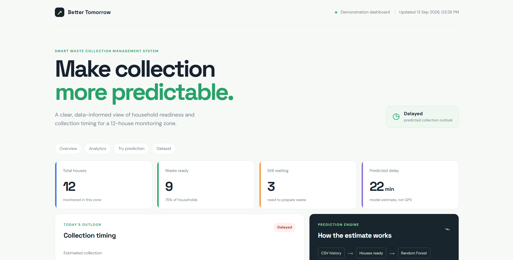
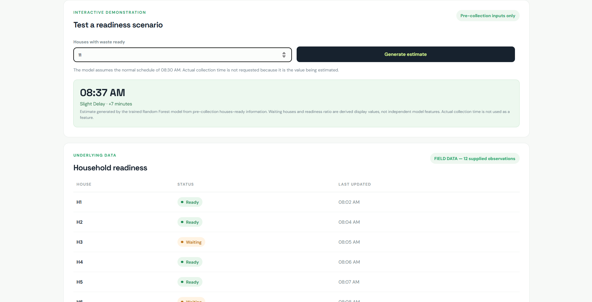

# ♻️ Smart Waste Collection Management System

> An intelligent, data-driven system designed to improve municipal waste collection by monitoring collection patterns, predicting delays, and helping optimize waste-collection operations.

## 📌 Project Status

**Current Development Progress: 35%**

This project is currently in the **prototype and development stage**.

The initial version focuses on understanding waste-collection patterns, organizing collection data, developing a web-based dashboard, and exploring machine-learning-based delay prediction.

The system is **not yet deployed for real-world municipal use**. Several components, including government approval, vehicle tracking, GPS integration, and large-scale field testing, are planned for future phases.

---

## 🎯 Problem Statement

Traditional waste collection systems may operate on fixed schedules without considering variations in:

* Collection vehicle arrival time
* Number of houses waiting for collection
* Daily collection patterns
* Vehicle delays
* Areas where waste is waiting for longer periods

These problems can result in residents leaving waste outside for extended periods, which may lead to issues such as stray animals scattering waste, unpleasant surroundings, and inefficient collection operations.

This project aims to develop a smarter system that uses **data and machine learning** to improve the efficiency and reliability of waste collection.

---

## 💡 Proposed Solution

The proposed system collects and analyzes waste-collection data and provides useful information through a web-based dashboard.

The system is intended to:

1. Record daily waste-collection information.
2. Monitor collection times and patterns.
3. Identify houses/areas waiting for collection.
4. Predict possible collection delays.
5. Provide useful information to collection operators.
6. Eventually integrate real-time vehicle tracking.
7. Support better route and schedule planning.


## Dashboard Preview

### Main Dashboard



### Prediction Interface



---

## 🛠️ Current Implementation

The current prototype includes the following components:

### ✅ Completed / In Progress

* [x] Initial problem identification
* [x] Data collection and dataset preparation
* [x] Initial waste-collection dataset
* [x] Basic data analysis
* [x] Project architecture planning
* [x] Machine-learning approach identified
* [x] Initial Python implementation
* [ ] Web dashboard refinement
* [ ] Extended dataset
* [ ] Machine-learning prediction refinement
* [ ] Real-world testing

### 📊 Current Dataset

The prototype currently uses a small sample dataset representing waste-collection activity across multiple houses and different collection times.

The dataset is being used for **prototype development and testing**.

As the project progresses, a larger and more representative dataset will be required for reliable machine-learning predictions.

---

## 🤖 Machine Learning

The proposed system uses machine learning to identify collection patterns and estimate possible delays.

The current approach explores **Random Forest Regression** for predicting collection delays based on available historical data.

Possible future input parameters include:

* Previous collection time
* Day of the week
* Number of houses waiting
* Historical delay
* Vehicle location
* Route information
* Collection area
* Weather conditions
* Traffic conditions

The machine-learning model will be improved as more real-world data becomes available.

---

## 🖥️ Technology Stack

### Current

* **Python**
* **Pandas**
* **Scikit-learn**
* **Flask**
* **HTML**
* **CSS**
* **JavaScript**
* **CSV / Dataset**

### Planned

* GPS / GNSS
* Vehicle tracking
* Mapping APIs
* Real-time database
* Cloud infrastructure
* Mobile interface
* Advanced machine-learning models

---

# 🚧 Development Roadmap

## Phase 1 — Prototype Development

**Status: 🟢 In Progress**

* Develop the basic data-processing system
* Prepare the initial dataset
* Build the web interface
* Implement collection monitoring
* Implement initial machine-learning model
* Test the system using sample data

**Progress: ~35%**

---

## Phase 2 — Extended Data Collection

**Status: 🟡 Planned**

The system will require a significantly larger dataset for reliable predictions.

Planned activities include:

* Collecting long-term collection data
* Recording vehicle arrival times
* Recording collection locations
* Recording number of houses waiting
* Recording route information
* Identifying recurring delays
* Improving dataset quality

---

## Phase 3 — Government / Municipal Approval

**Status: ⚪ Future**

Before real-world deployment, the project will require appropriate permission and coordination with the relevant **municipal/local government authorities and waste-management departments**.

The objective will be to conduct a controlled pilot deployment rather than immediately deploying the system across an entire city.

---

## Phase 4 — GPS Vehicle Tracking

**Status: ⚪ Future**

Subject to approval and funding, GPS/GNSS tracking devices could be installed in waste-collection vehicles.

The proposed system would allow authorized personnel to monitor:

* Current vehicle location
* Vehicle movement
* Route progress
* Collection areas covered
* Approximate arrival time
* Delays or deviations from planned routes

This information could be integrated into the web dashboard.

---

## Phase 5 — Real-Time Monitoring

**Status: ⚪ Future**

Once GPS tracking and backend infrastructure are available, the system could provide real-time monitoring.

Possible features:

* 🗺️ Live vehicle location
* 🚛 Vehicle status
* 📍 Collection-area monitoring
* ⏱️ Estimated arrival time
* ⚠️ Delay alerts
* 📊 Collection performance statistics

---

## Phase 6 — Intelligent Route Optimization

**Status: ⚪ Future**

With sufficient historical and real-time data, the system could eventually move beyond delay prediction and assist with route optimization.

Possible factors:

* Number of houses waiting
* Vehicle location
* Distance
* Traffic
* Collection priority
* Historical collection time
* Vehicle availability

The objective would be to reduce unnecessary travel, waiting time, and missed collections.

---

# 🔮 Future Vision

The long-term goal is to develop the prototype into a **real-world intelligent waste-management platform**.

The proposed future system could work as follows:

```text
Households
    ↓
Waste Collection Data
    ↓
Central System
    ↓
AI / Machine Learning
    ↓
Delay & Demand Prediction
    ↓
GPS Vehicle Tracking
    ↓
Real-Time Dashboard
    ↓
Better Collection Decisions
```

The system could eventually help municipalities make **data-driven decisions instead of relying entirely on fixed schedules**.

---

# 📈 Current Progress

| Component              | Status         |
| ---------------------- | -------------- |
| Problem Identification | ✅ Completed    |
| Solution Design        | ✅ Completed    |
| Initial Dataset        | ✅ Completed    |
| Data Analysis          | 🟢 In Progress |
| Python Prototype       | 🟢 In Progress |
| Web Dashboard          | 🟡 In Progress |
| Machine Learning       | 🟡 In Progress |
| Extended Dataset       | ⚪ Planned      |
| GPS Integration        | ⚪ Planned      |
| Real-Time Tracking     | ⚪ Planned      |
| Government Approval    | ⚪ Future       |
| Field Testing          | ⚪ Future       |
| Full Deployment        | ⚪ Future       |

### Overall Progress: **~35%**

---

# ⚠️ Current Limitations

The current version is a **prototype**, and therefore has several limitations:

* The available dataset is relatively small.
* The data is not yet representative of a complete municipal waste-collection system.
* Real-time GPS data is not currently integrated.
* The system has not yet undergone large-scale field testing.
* Machine-learning accuracy cannot be considered production-ready at this stage.
* Government/municipal permissions are required before real-world deployment.
* Actual deployment would require appropriate hardware, infrastructure, security, and maintenance.

These limitations will be addressed progressively during future development.

---

# 🌱 Long-Term Goal

The ultimate objective is to create a scalable waste-collection system that connects **households, collection vehicles, operators, municipal authorities, and AI-based analytics** into a single platform.

The project will progressively move from:

**Prototype → Data Collection → Pilot Testing → GPS Integration → Real-Time Monitoring → Intelligent Optimization**

---

# 👨‍💻 Project Development

This project is being developed as an academic/prototype project to explore how **Artificial Intelligence, data analysis, and IoT/GPS technologies** can be applied to improve everyday municipal services.

The current implementation should be considered a **proof of concept**, with real-world deployment planned only after sufficient testing, validation, and appropriate authorization.

---

## 📜 License

This project is currently developed for educational and prototype purposes.


